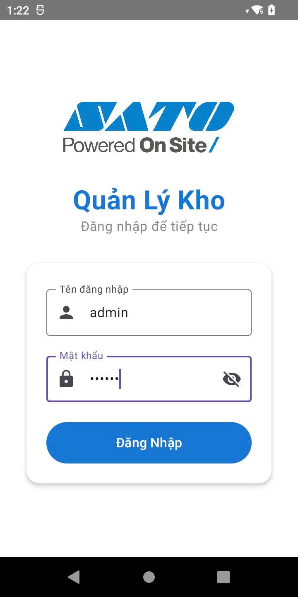
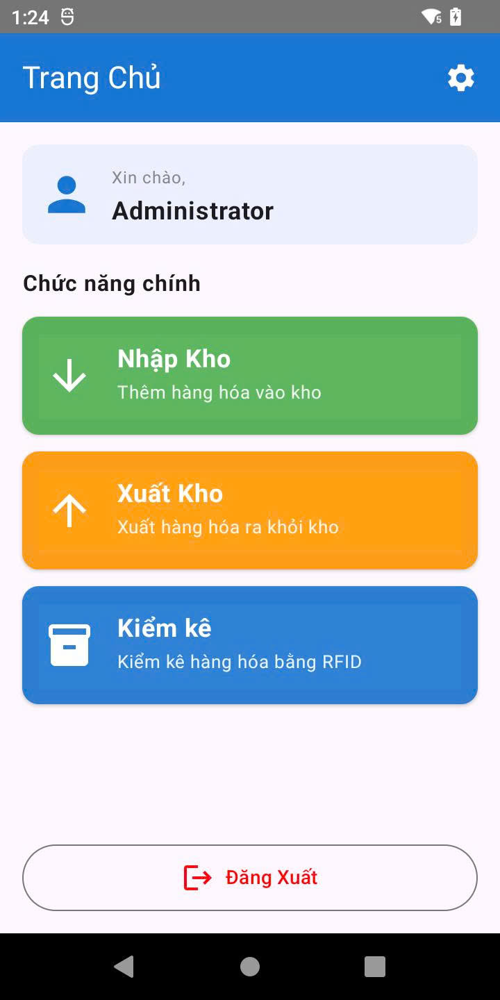
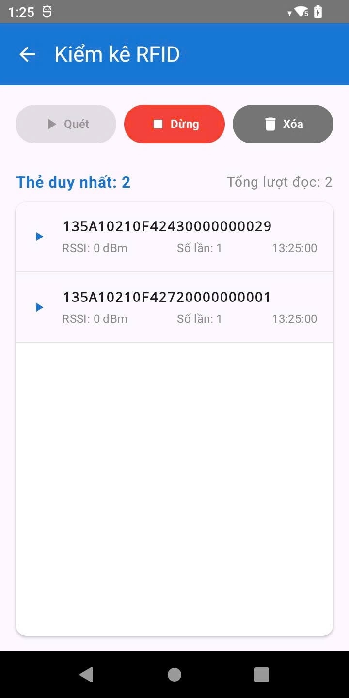

# Sample Warehouse Management System

A comprehensive Android application designed for managing sample inventory, serving dual purposes as a training tool for sales teams and a demonstration platform for presenting company solutions to potential clients.

## 📋 Overview

This mobile warehouse management system enables efficient tracking and control of product samples through RFID technology. The application streamlines the entire sample lifecycle - from receiving inventory to distribution and stock auditing - while providing real-time visibility into sample availability and location.

## ✨ Features

### Core Functionality
- **User Authentication** - Secure login system with role-based access control
- **Inventory Import** - Register incoming samples with RFID scanning capabilities
- **Inventory Export** - Track sample checkouts and assignments to sales personnel
- **Stock Audit** - Comprehensive inventory counting and reconciliation with RFID batch scanning
- **Real-time Sync** - Automatic data synchronization with backend servers

## 📸 Screenshots

### Login

### Menu

### RFID 

### Additional Capabilities
- RFID tag reading for fast and accurate sample identification
- Barcode scanning integration

## 🛠 Technology Stack

### Core Technologies
- **Language**: Kotlin
- **UI Framework**: Jetpack Compose (Modern declarative UI)
- **Architecture**: MVVM (Model-View-ViewModel)

### Key Libraries & Components

| Component | Library | Purpose |
|-----------|---------|---------|
| Navigation | Navigation Compose | Screen navigation and routing |
| Networking | Retrofit 2 | RESTful API communication |
| Lifecycle | Android Lifecycle | Lifecycle-aware components |
| Local Storage | DataStore | Preferences and settings persistence |
| Async Operations | Kotlin Coroutines | Asynchronous programming |
| RFID Integration | RFID SDK | Hardware scanner integration |
| System Events | BroadcastReceiver | System-level event handling |
| Dependency Injection | Hilt / Koin | Dependency management |
| JSON Parsing | Gson / Kotlinx Serialization | Data serialization |

## 📱 Requirements

### Development Environment
- **Android Studio**: Hedgehog (2023.1.1) or later
- **JDK**: 17 or higher
- **Gradle**: 8.0+
- **Kotlin**: 1.9.0+

### Device Requirements
- **Minimum SDK**: API 24 (Android 7.0)
- **Target SDK**: API 34 (Android 14)
- **Recommended**: Devices with RFID reader support
- **Permissions Required**:
  - Internet access
  - Camera (for barcode scanning)
  - Storage access
  - RFID hardware access

### Hardware Compatibility
- Android smartphones and tablets
- Handheld RFID readers (Zebra, Chainway, CipherLab, etc.)
- Integrated RFID-enabled devices
