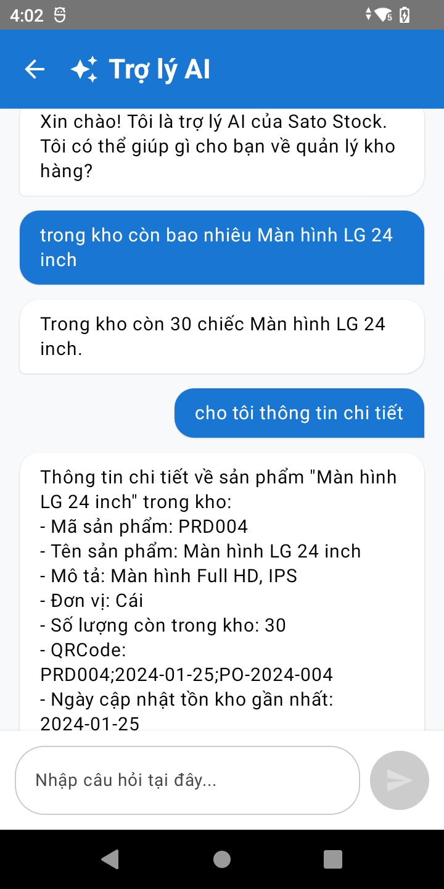
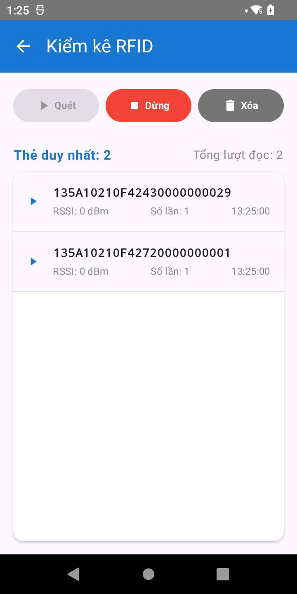

# StockDemo — Warehouse Management System (Android)

[](https://github.com/nminhcuongdev/stockdemo.Android/actions/workflows/ci.yml)

**StockDemo** is a modern Android application for warehouse management, built with
**Jetpack Compose** and **Clean Architecture**. It works offline-first, integrates a
physical **UHF RFID reader** (CipherLab), and connects to a .NET backend plus an AI
assistant.

## Features

### Authentication
* **Login** with JWT; the session token is stored in DataStore and attached to every request.
* **Auto sign-out** when a token expires or the server returns `401` (via an OkHttp interceptor).

### Dashboard
* At-a-glance stats: total stock items, total quantity, product count, pending-sync count.
* **Low-stock alerts** for products below their reorder (min) level.
* Quick actions to jump straight into any warehouse operation.

### Stock In / Out (Import / Export)
* Record goods **receipt** and **dispatch** by scanning the product QR code and location.
* **Offline-first**: transactions are queued locally (Room) and **synced in the background**
  (WorkManager) when connectivity returns.
* Full **Import / Export history** with paging.

### Stock Transfer
* Move stock between locations.
* Source stock is selected by **scanning its QR code** (hardware scanner), then a destination
  location and quantity are chosen — with on-hand validation.

### Stocktake (Inventory Count & Reconciliation)
* Create a stocktake for a location, enter counted quantities, and reconcile against system
  quantities.

### Reports
* **Stock-movement report** over a selectable date range.

### RFID Inventory
* **Continuous multi-tag scanning** with the CipherLab UHF reader — reads until *Stop* is pressed.
* Tuned reader parameters (Session, AB-flip, Dynamic Q, MultiTag mode) for reliable multi-tag reads.
* **Configurable reader settings** (transmit power, session, work mode, duplicate filter) in the
  Settings screen, plus an **inline power slider** on the scan screen that applies live.
* **EPC → product resolution**: scanned tags are matched to products through a **server-side
  EPC-to-Stock mapping** (shared across devices), so the list shows product info instead of raw
  EPCs. Unmapped tags are ignored. Tags can be (re)assigned to a product from the screen.

### AI Chat
* Ask questions and get data analysis from an AI assistant backed by a separate Python service.

### Settings
* Language (Vietnamese / English) and RFID reader configuration.

## Tech Stack

* **Language:** Kotlin
* **UI:** Jetpack Compose + Material 3
* **Architecture:** Clean Architecture (Domain / Data / Presentation) + MVVM
* **DI:** Hilt (Dagger)
* **Networking:** Retrofit 2 + OkHttp 4 (auth & 401 interceptors)
* **Local storage:** Room (offline cache + pending-sync queue)
* **Preferences:** Jetpack DataStore
* **Background work:** WorkManager + HiltWorker
* **Paging:** Paging 3
* **Async:** Kotlin Coroutines & Flow
* **Navigation:** Navigation Compose
* **Hardware:** CipherLab UHF RFID SDK

## Project Structure

```text
com.example.stockdemo/
|-- core/               # Shared components (DI, network, RFID prefs, session, theme, utils)
|-- feature/
|   |-- auth/           # Login and user session management
|   |-- stock/          # Warehouse logic: in/out, transfer, stocktake, report, RFID inventory
|   |-- chat/           # AI chat
|   `-- home/           # Menu, dashboard, settings
`-- app/
    `-- navigation/     # NavGraph and screen definitions
```

## Setup and Configuration

### Prerequisites

* Android Studio (Ladybug or newer)
* **JDK 17+** (Gradle 8.11 / AGP 8.8)
* Android SDK 24+ (compileSdk 35)

### Backend endpoints

The app uses Gradle product flavors (`dev` / `prod`) for environment separation. Edit the URLs
in `gradle.properties`:

```properties
stockdemo.dev.stockBaseUrl=http://10.0.2.2:5000/api/   # 10.0.2.2 = host from the emulator
stockdemo.dev.pythonBaseUrl=http://10.0.2.2:8000/
stockdemo.prod.stockBaseUrl=https://api.example.com/
stockdemo.prod.pythonBaseUrl=https://python-api.example.com/
```

> Running on a **physical device** connected by USB? Point `stockBaseUrl` at
> `http://localhost:5000/api/` and forward the port with `adb reverse tcp:5000 tcp:5000`.

## Build and Run

1. Clone this repository.
2. Open it in Android Studio and let Gradle sync.
3. Pick a build variant (e.g. `devDebug`) and press **Run**, or from the CLI:
   ```bash
   ./gradlew installDevDebug
   ```

## Screenshots

| AI Assistant | RFID Inventory |
| --- | --- |
|  |  |

## License

Developed for internal warehouse management purposes.
